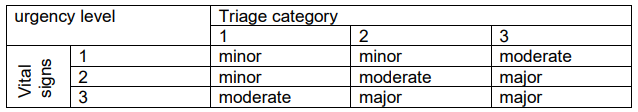
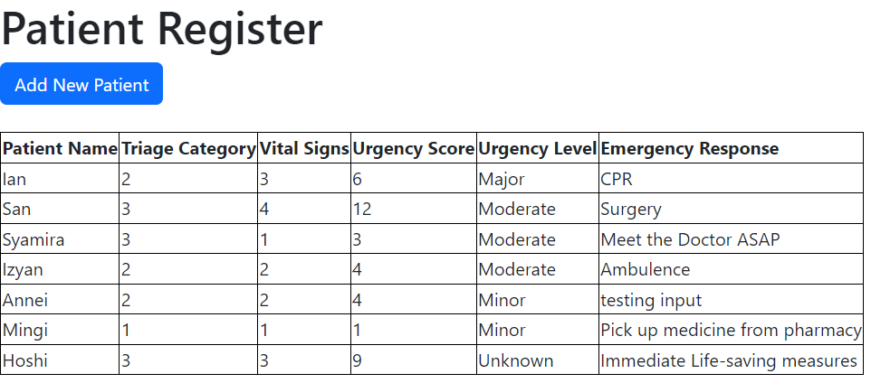
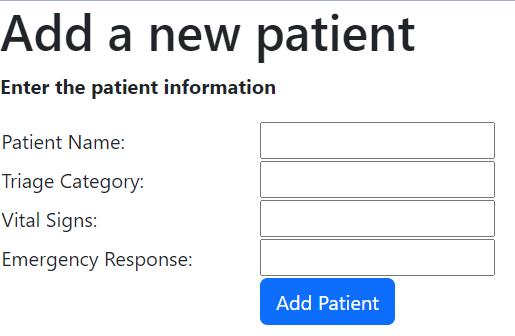
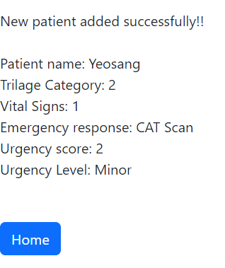

# Patient-Tracker-EMS

WIF2003: Web Programming - Lab Test

An emergency management system is implemented to track patients referred to the emergency department of a hospital. m is implemented to track patients referred to the emergency department of a hospital. As part of this system, an Emergency Management Tool is utilized to document and manage important information related to each patient, including their Name, Triage Category, Vital Signs, and emergency response. The Triage Category is based on the severity of their condition (3 for Emergent, 2 for Urgent, and 1 for Non-urgent). The Vital Signs are measurements of the body's basic functions and indicate the overall health and stability of a patient (1 for stable, 2 for moderate, and 3 for not stable).

The Emergency Management Tool functions as a simple Patient Tracker, allowing the hospital
staff to record patient information, calculate the urgency score based on Triage Category and
Vital Signs, and then assess the urgency level of each patient. In this tool, we have ‘indexPatient.php' and 'addPatient.php' web pages. 

To deteremne the urgency level we follow the table below:

The Output of the system is as bellow:

